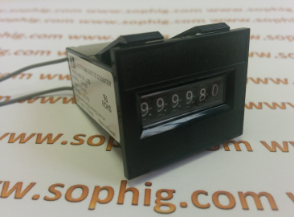

# MetersReader

This is the repository for our electromechanical meters, [6 digit mechanical meter](http://www.sophig.com/110/e-shop/magnetic-counters/6-digits). More info is available at [sophig.com](http://www.spohig.com).
- [Company Website](http://www.sophig.com)
- [My Personal Website](http://www.dzacovsky.com)

## App decription
Small app to read impulses that were made to turn electromechanical counters. 

## Instructions
Make sure you understand electronics. Meters are runing on 12V and majority of the boards, including Arduino on 5V. If you connect it directly you may destroy your Arduino.
